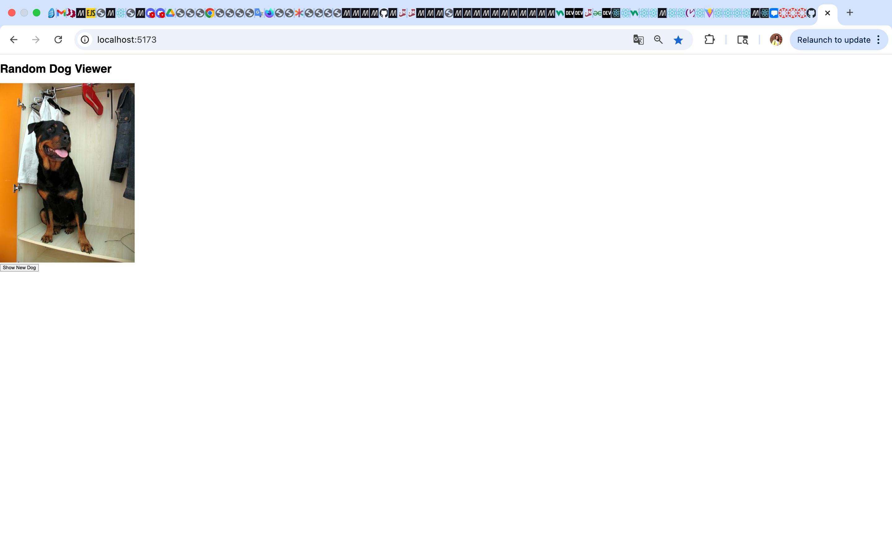

# React Simple Data Fetching Lab

## Learning Goals

- Use the `useEffect` hook to fetch data from an API and render to the page.
- Use an event handler to fetch data from an API and render to the page.

## Getting Started
- Fork this lab on GitHub and clone locally.
- To run the lab:
```bash
npm run dev
```
- To run the test suite:
```bash
npm run test
```
- Commit and push your code as you go.

## Deliverables

This lab is missing the `App` component that `index.js` is looking for. To pass
the tests in this lab:

- Create an `App` component from scratch, along with any other components you 
  choose for the component hierachy.
- Use the `useEffect` hook in the `App` component. Inside the callback for
  `useEffect`, send a `fetch` request to
  `https://dog.ceo/api/breeds/image/random`, a free API that returns a random
  image of a dog.
- Display a `<p>` tag with the text of "Loading..." when the component is first
  rendered
- After receiving a response from the API, show the dog image in an `` tag,
  with the `alt` attribute set to "A Random Dog".
  - For the test suite to work properly, this should be the only `` tag in 
  the application .
- Create a `<button>` tag that, on click, fetches a new dog image and updates the 
  dog image displayed.
  - For the test suite to work properly, this should be the only `<button>` tag in 
  the application .

## Lab Instructions
### 1. Define the Problem
* Load a random dog image on the page when the app first loads.
* Allow the user to change the dog image by a button click.
* Display a loading message for the user while waiting for API requests.
### 2. Determine the Design
* Determine Component Tree
  * At minimum, you'll need an App component for the test suite
* Determine state and props needed for each component
### 3. Develop the Code
* Open React application in browser
```bash
npm run dev
```
  - Run test suite
```bash
npm run test
```
* Create components and render
* Manage component state and props
* Implement useEffect and button with onClick
* Add fetch requests to both the event handler and useEffect
  * Fetch requests should make a GET request to “https://dog.ceo/api/breeds/image/random”
* Update state accordingly to store the current dog image
* Render the dog image in the jsx based on the data from the fetch request
  * Be sure to look at how the data is formatted from the fetch request when setting the 
  properties of the HTML image tag.
### 4. Test and Refine 
* Debugging and testing during coding using React DevTools in Chrome
### 5. Document and Maintain 
* Commit as you go, writing meaningful commit messages
* Push commit history to GitHub periodically and when lab is complete

## Submission
Once the lab is complete, all tests are passing, and you've pushed the completed code to 
your forked repo on GitHub, submit your GitHub repo through Canvas using CodeGrade.

## My Completed Project

This app fetches and displays a random dog image from the [Dog CEO API](https://dog.ceo/api/breeds/image/random).

### Features Implemented

- Fetch dog image on first load using `useEffect`
- Show loading message while fetching
- Display the dog image in the browser
- Load new image when button is clicked
- All tests passed 

### Screenshot



Project completed and working as expected!


